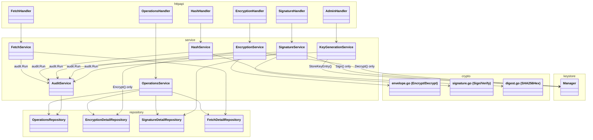
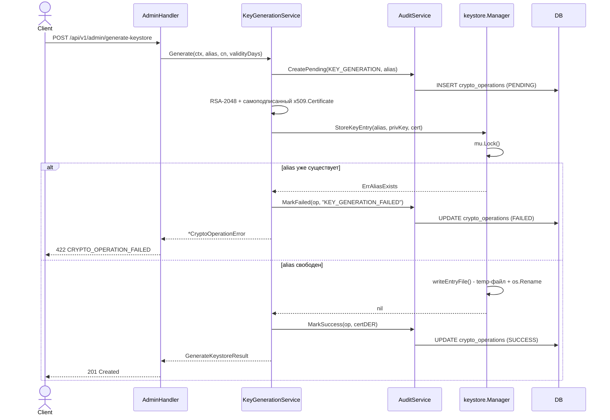
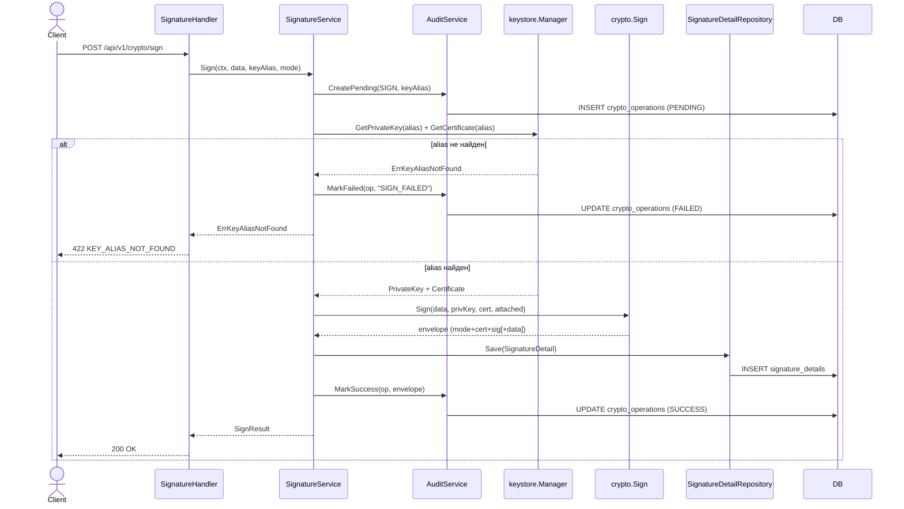
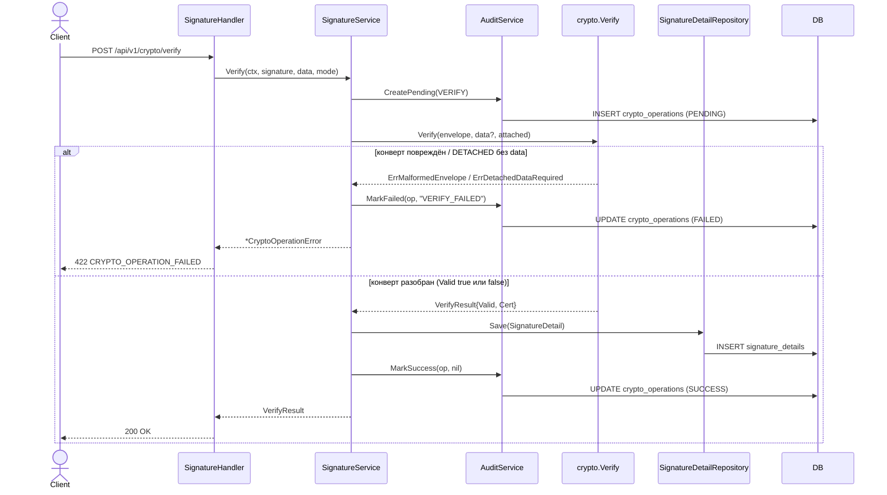
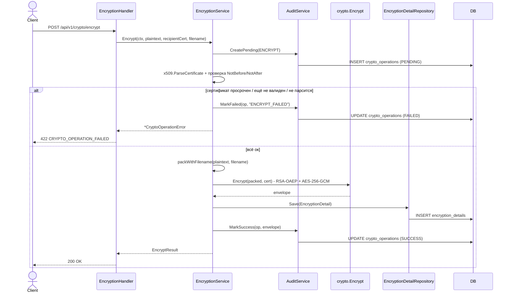
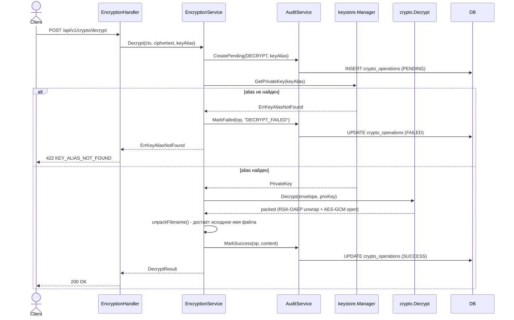
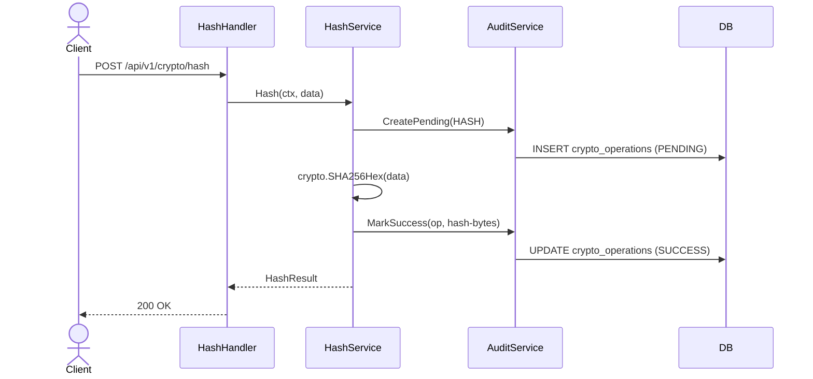
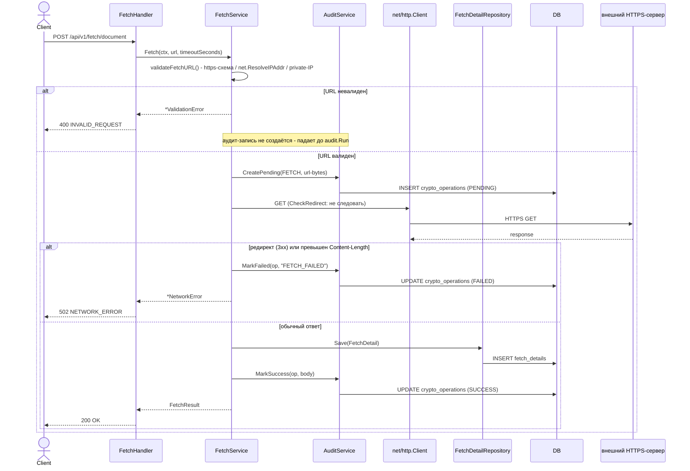
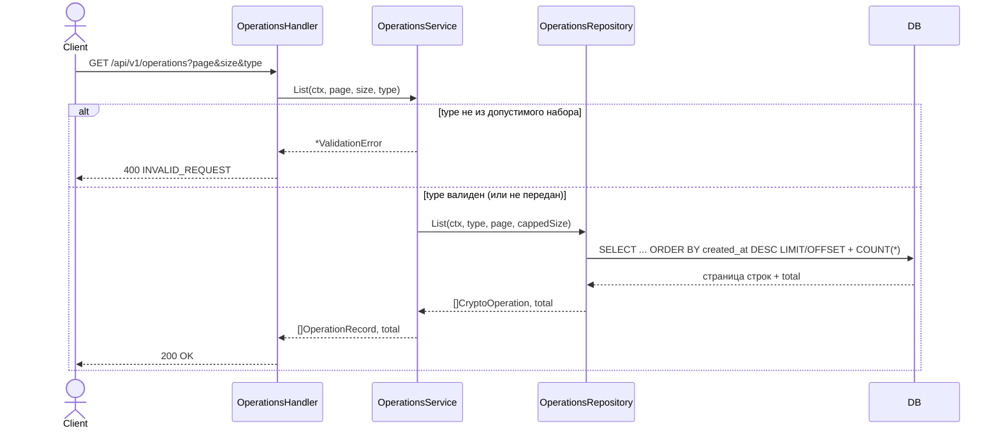
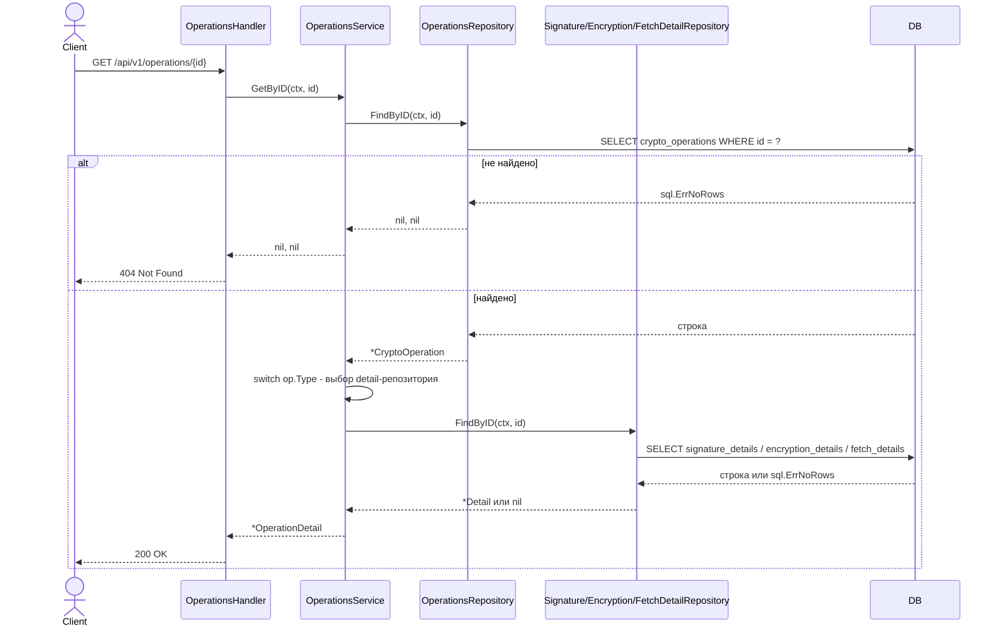

# Go Crypto Service

Тот же функционал (подпись, шифрование, хэш, HTTPS-fetch, аудит-история операций), своя Go-идиоматичная реализация. 
Без  Web UI - только REST API. 

## Стек

Go 1.25, стандартная библиотека для HTTP (`net/http`, Go 1.22+ маршрутизация по методу) и крипты
(`crypto/rsa`, `crypto/aes`, `crypto/x509`), `modernc.org/sqlite` (чистый Go-драйвер SQLite, без
cgo), `golang.org/x/crypto/scrypt` для keystore, `github.com/google/uuid`. Ни фреймворка, ни ORM -
только `database/sql` и ручные SQL-запросы. Собирается штатным `go build`, есть Dockerfile и
docker-compose.

## Что нужно для запуска

Go 1.25+, либо просто Docker.

## Запуск

Пароль от keystore берётся из переменной окружения - в коде и конфигах его нет:

```bash
export KEYSTORE_PASSWORD=changeit
go run ./cmd/server
```

Или через Docker Compose:

```bash
KEYSTORE_PASSWORD=changeit docker-compose up --build
```

Поднимается на `http://localhost:8080`. Если директории keystore ещё нет  сервис
стартует с пустым хранилищем (создаёт директорию), ключ можно сгенерировать позже через API.

Сгенерировать ключ:

```bash
curl -s -X POST http://localhost:8080/api/v1/admin/generate-keystore \
  -H "Content-Type: application/json" \
  -d '{"alias":"crypto-key","cn":"CryptoService","validityDays":365}' | jq .
```

В ответе `certBase64` - DER-сертификат, он же потом идёт как `recipientCertificate` при
шифровании.

`/api/v1/admin/...` так же, как в Java-версии, оставлен без аутентификации - нормально для
тестового задания, не для прода.

## API и эндпоинты

| Метод | URL                               | Что делает                                         |
|-------|-----------------------------------|----------------------------------------------------|
| POST  | `/api/v1/admin/generate-keystore` | генерит RSA-2048 ключ + самоподписанный сертификат |
| POST  | `/api/v1/crypto/sign`             | подпись (свой конверт, ATTACHED/DETACHED)          |
| POST  | `/api/v1/crypto/verify`           | проверка подписи                                   |
| POST  | `/api/v1/crypto/encrypt`          | шифрование RSA-OAEP + AES-256-GCM                  |
| POST  | `/api/v1/crypto/decrypt`          | расшифровка                                        |
| POST  | `/api/v1/crypto/hash`             | SHA-256                                            |
| POST  | `/api/v1/fetch/document`          | скачать документ по HTTPS                          |
| GET   | `/api/v1/operations`              | история операций (пагинация, фильтр по типу)       |
| GET   | `/api/v1/operations/{id}`         | одна операция по id                                |

`convert/encode` и `convert/decode` из Java-версии не перенесены - это были чисто UI-хелперы
(base64 туда-обратно для веб-формы), а UI тут нет.

Пример полного цикла curl'ом:

```bash
# 1. Сгенерировать ключ (см. выше), сохранить certBase64

# 2. Зашифровать
curl -s -X POST localhost:8080/api/v1/crypto/encrypt \
  -d '{"plaintext":"aGVsbG8=","recipientCertificate":"<certBase64>","filename":"hi.txt"}'

# 3. Расшифровать тем же alias
curl -s -X POST localhost:8080/api/v1/crypto/decrypt \
  -d '{"ciphertext":"<ciphertext из ответа>","keyAlias":"crypto-key"}'

# 4. Подписать / проверить
curl -s -X POST localhost:8080/api/v1/crypto/sign \
  -d '{"data":"aGVsbG8=","keyAlias":"crypto-key","mode":"ATTACHED"}'
curl -s -X POST localhost:8080/api/v1/crypto/verify \
  -d '{"signature":"<signature из ответа>","mode":"ATTACHED"}'
```

## Как тестировать

```bash
go build ./...
go vet ./...
go test ./...
```

Тесты: `internal/crypto` (round-trip encrypt/decrypt, sign/verify в обоих режимах, известные
SHA-256 векторы, порча данных/просроченный сертификат → `valid: false`), `internal/keystore`
(генерация/сохранение/перезагрузка алиаса с диска, дубликат алиаса, неверный пароль),
`internal/httpapi` (HTTP-уровень целиком: `httptest` + настоящая sqlite во временном файле -
generate-keystore → sign/verify, encrypt/decrypt round-trip, hash, коды ошибок 400/422,
`operations` list/detail). Крипто- и keystore-тесты бьют по настоящим `crypto/rsa` реализациям,
моков нет.

Руками - тот же curl-сценарий, что выше, либо `/api/v1/fetch/document` с любым HTTPS URL
(`https://httpbin.org/json` подходит).

## Структура

```
cmd/server/            # main.go: конфиг, sqlite, keystore, роутер, ListenAndServe
internal/
├── config/             # переменные окружения
├── httpapi/             # маршрутизация, handler'ы, маппинг ошибок → HTTP-статус
├── service/              # бизнес-логика, аудит (audit.Run), генерация ключей
├── crypto/                # чистые крипто-функции на байтах, без I/O
├── keystore/               # PEM+AES-GCM хранилище ключей на диске
├── repository/              # database/sql поверх sqlite, руками написанные запросы
└── model/                    # доменные типы (CryptoOperation, OperationType, ...)
migrations/
└── schema.sql                # DDL, встраивается в бинарник через go:embed
Dockerfile                     # multi-stage: golang:1.25-alpine build → alpine:3.20 runtime
docker-compose.yml
```

## БД

SQLite-файл (`DB_PATH`, по умолчанию `./data/cryptodb.sqlite`). Таблицы те же четыре, что в
Java: `crypto_operations` - общий лог всех операций, плюс детали по типу - `signature_details`,
`encryption_details`, `fetch_details`. Схема накатывается один раз при старте (`CREATE TABLE IF
NOT EXISTS`), отдельного инструмента миграций нет - для такого масштаба избыточно.

## Архитектура

**Слоистая архитектура**, тот же принцип, что в Java: `httpapi -> service -> (crypto | keystore |
repository) -> model`, зависимость всегда вниз, никакой бизнес-логики в handler'ах.

## Форматы данных

Три байт-маркера — везде один и тот же приём: тип/версия в первом байте блоба, чтобы читающая
сторона знала, как разбирать остальное, без внешней схемы.

- **`filenamePackMarker = 0x01`** (`internal/service/encryption_service.go`) — тот же приём, что в
  Java-версии (`FORMAT_MARKER_PACKED_FILENAME`): `[1B marker][4B BE uint32 name length][name][content]`.
  Упаковывается в `packWithFilename` перед `crypto.Encrypt`, распаковывается в `unpackFilename` после
  `crypto.Decrypt`. Если первый байт не `0x01` — считается, что имени не было, весь payload отдаётся
  как content
- **`envelopeVersion = 0x01`** (`internal/crypto/envelope.go`) — версия формата шифр-конверта:
  `[1B version][2B len(wrappedKey)][wrappedKey][12B nonce][ciphertext+tag]`. `Decrypt` сверяет
  первый байт, при несовпадении — `ErrMalformedEnvelope`
- **`SignModeAttached = 0x00` / `SignModeDetached = 0x01`** (`internal/crypto/signature.go`) —
  режим в первом байте конверта подписи: `[1B mode][2B len(certDER)][certDER][2B len(sig)][sig][data,
  только если ATTACHED]`. `Verify` читает этот байт вместо отдельного параметра — конверт сам
  описывает, в каком режиме он был создан

В Java маркер только один — для filename, потому что это единственное, что CMS `EnvelopedData`/
`SignedData` (BouncyCastle) сами по себе не хранят.

## Переменные окружения

| Переменная          | Что                        | Обязательна                                |
|---------------------|----------------------------|--------------------------------------------|
| `KEYSTORE_PASSWORD` | пароль от keystore         | да                                         |
| `KEYSTORE_PATH`     | путь к директории keystore | нет, по умолчанию `./certs`                |
| `DB_PATH`           | путь к sqlite-файлу        | нет, по умолчанию `./data/cryptodb.sqlite` |
| `PORT`              | HTTP-порт                  | нет, по умолчанию `8080`                   |

## Диаграммы

Компонентная схема.



### POST /api/v1/admin/generate-keystore



### POST /api/v1/crypto/sign



### POST /api/v1/crypto/verify



`valid: false` - тоже 200, не ошибка (просроченный сертификат подписанта или несходящаяся подпись).
FAILED - только для действительно битого конверта. Сертификат подписанта берётся из тела конверта,
`keystore.Manager` не участвует.

### POST /api/v1/crypto/encrypt



### POST /api/v1/crypto/decrypt



В отличие от `encrypt`, `decrypt` не пишет в `EncryptionDetailRepository` - деталь сохраняется один
раз, на шаге шифрования.

### POST /api/v1/crypto/hash



Своей detail-таблицы у `HASH` нет - результат целиком в `crypto_operations.output_hash`.

### POST /api/v1/fetch/document



### GET /api/v1/operations



Read-only ручка над аудит-логом - сама новых записей не создаёт, через `audit.Run` не идёт.

### GET /api/v1/operations/{id}



Для `HASH`/`KEY_GENERATION` detail-репозиторий не опрашивается (нет ветки в `switch`) - только
общие поля.
