# Java Crypto Service

Тестовое задание: REST-сервис на Java + Spring Boot, который умеет подписывать документы (PKCS#7),
шифровать/расшифровывать (RSA+AES-GCM), считать SHA-256 и тянуть файлы по HTTPS. Сверху - простой Web UI,
чтобы всё это можно было потыкать руками, не собирая curl-команды вручную.

## Стек

Java 17, Spring Boot 3.3.5 (Tomcat из коробки), Bouncy Castle 1.78.1 для крипты, H2 в файловом режиме +
JPA + Flyway под миграции, Swagger UI сверху. Собирается Maven'ом, есть Dockerfile и docker-compose.

## Что нужно для запуска

Java 17+ и Maven 3.8+, либо просто Docker.

## Запуск

Пароль от keystore берётся из переменной окружения - в коде и конфигах его нет:

```bash
export KEYSTORE_PASSWORD=changeit
mvn spring-boot:run
```

Или через Docker Compose:

```bash
KEYSTORE_PASSWORD=changeit docker-compose up --build
```

Поднимается на `http://localhost:8080`. Если файла keystore ещё нет - сервис стартует с
пустым хранилищем, ключ можно сгенерировать позже через API (или прямо из UI).

Сгенерировать ключ можно так:

```bash
curl -s -X POST http://localhost:8080/api/v1/admin/generate-keystore \
  -H "Content-Type: application/json" \
  -d '{"alias":"crypto-key","cn":"CryptoService","validityDays":365}' | jq .
```

В ответе будет `certBase64` - DER-сертификат, он же потом идёт как `recipientCertificate` при шифровании.

Важный момент: `/api/v1/admin/...` специально оставлен без какой-либо аутентификации. Для тестового
задания это нормально, но не для прода - там ключи генерятся офлайн (keytool/openssl), хранятся в
чём-то вроде Vault и никогда не показываются в теле ответа.

## Web UI

По адресу `http://localhost:8080/` находится простая страничка на чистом HTML/JS - без сборки, без npm.
На ней вкладки под каждую операцию (Encrypt, Decrypt, Sign, Verify, Hash, Fetch, Keystore), в каждую можно либо
загрузить файл, либо просто вставить текст - base64 руками кодировать не надо, этим занимается отдельная ручка
`/api/v1/convert/encode`. Результат (шифртекст, подпись и т.д.) можно сразу скачать файлом через
`/api/v1/convert/decode`.

Пара оговорок по этим convert-ручкам:

- в аудит (`crypto_operations`) они не попадают - это не крипто-операция, а просто конвертация для
  удобства UI-
- на проде в `encode` логично было бы ещё сохранять оригинальный файл в S3 (или другое объектное
  хранилище) со ссылкой на операцию, а `decode` - отдавать presigned URL, а не сырые байты. Для теста
  это явно лишнее, поэтому это не было реализовано
- и самое главное - сейчас они, как и всё остальное, открыты без авторизации. На проде так нельзя:
  через `encode` можно закачать что угодно и прогнать в base64 без всякого контроля, так что эти ручки
  нужно закрывать той же аутентификацией, что и весь остальной API, а не оставлять открытыми

## API и эндпоинты

Swagger: `http://localhost:8080/swagger-ui.html`
H2-консоль: `http://localhost:8080/h2-console` (JDBC URL `jdbc:h2:file:./data/cryptodb`)

| Метод | URL                               | Что делает                                         |
|-------|-----------------------------------|----------------------------------------------------|
| POST  | `/api/v1/admin/generate-keystore` | генерит RSA-2048 ключ + самоподписанный сертификат |
| POST  | `/api/v1/crypto/sign`             | подпись PKCS#7                                     |
| POST  | `/api/v1/crypto/verify`           | проверка подписи                                   |
| POST  | `/api/v1/crypto/encrypt`          | шифрование RSA+AES-GCM                             |
| POST  | `/api/v1/crypto/decrypt`          | расшифровка                                        |
| POST  | `/api/v1/crypto/hash`             | SHA-256                                            |
| POST  | `/api/v1/fetch/document`          | скачать документ по HTTPS                          |
| GET   | `/api/v1/operations`              | история операций (пагинация, фильтр по типу)       |
| GET   | `/api/v1/operations/{id}`         | одна операция по id                                |
| POST  | `/api/v1/convert/encode`          | файл/текст → base64, для UI                        |
| POST  | `/api/v1/convert/decode`          | base64 → файл на скачивание, для UI                |

## Как тестировать

Автотесты гоняются обычным `mvn test` - контроллеры проверены через MockMvc, сервисы замоканы Mockito,
а для крипто-провайдеров есть отдельные тесты (например для SHA-256).

Руками проще всего проверить через сам Web UI. Зайти на `http://localhost:8080/` и по порядку:

1. Вкладка **Keystore** - генеришь ключ (alias, скажем, `crypto-key`), из ответа сохранять `certBase64`,
   он ещё понадобится. Можно сразу скачать сертификат кнопкой.
2. **Encrypt** - текст произвольный, сертификат вставляешь как base64 (или файлом, если скачал на шаге 1).
   Получаешь ciphertext.
3. **Decrypt** - тот же ciphertext, тот же alias - должен вернуться исходный текст.
4. **Sign** - подписываешь текст или файл тем же alias, режим ATTACHED или DETACHED.
5. **Verify** - подпись из прошлого шага, для DETACHED ещё и исходный документ - должно вернуть `valid: true`.
6. **Hash** - просто текст или файл, получаешь SHA-256.
7. **Fetch** - любой HTTPS URL (`jsonplaceholder.typicode.com/todos/1` вполне подойдёт: первый запрос к нему - выдаст
   ошибку, последующие сработают как надо - такой url был выбран для показа обработки такой ошибки) - видно контент,
   тип, статус, можно скачать.

Единственное, что реально важно по порядку - alias должен существовать до того, как будут дергаться
Encrypt/Decrypt/Sign. Остальное можно тыкать в любой последовательности.

## Структура

```
src/main/java/com/alfabank/crypto/
├── config/          # BC-провайдер, keystore, OpenAPI
├── controller/      # REST-контроллеры
├── service/         # бизнес-логика, аудит, генерация ключей
├── crypto/          # чистые крипто-провайдеры на байтах, без I/O
├── keystore/        # загрузка ключей из P12
├── model/           # JPA-сущности
├── repository/      # Spring Data репозитории
├── dto/             # request/response объекты
└── exception/       # исключения + глобальный handler

src/main/resources/
├── application.yml
├── static/          # Web UI (index.html, style.css, app.js)
└── db/migration/    # Flyway
```

## БД

H2 в файле, `./data/cryptodb`. Таблиц четыре: `crypto_operations` - общий лог всех операций, плюс
детали по каждому типу - `signature_details`, `encryption_details`, `fetch_details`.

## Архитектура

**Слоистая архитектура**, паттерн **Controller-Service-Repository**

**Паттерны, которые тут есть:**

- **Strategy** в `crypto/` - у каждой крипто-операции (encrypt/decrypt/sign/verify/hash)
  свой маленький `@Component` с одним публичным методом, без состояния, помеченный маркер-интерфейсом
  `CryptoProvider`. Роль везде одна: взять байты на входе, отдать байты (или
  небольшой результат) на выходе, ничего не знать о HTTP или БД
- **`OperationType` как единый источник правды** - семь типов операций (`ENCRYPT`/`DECRYPT`/`SIGN`/
  `VERIFY`/`HASH`/`FETCH`/`KEY_GENERATION`) объявлены один раз в `model/OperationType.java`.
  `AuditedOperation.run(...)` принимает `OperationType`, а не голую строку, поэтому опечатка в
  типе операции не компилируется. `OperationsService` тоже валидирует `?type=` и диспетчерит
  detail-репозиторий через `OperationType.valueOf(...)`, а не через отдельно поддерживаемый набор строк
- **Единственная точка записи в keystore** - `KeystoreManager.storeKeyEntry(...)` (под тем же
  write-lock'ом, что и чтения). `KeyGenerationService` генерит ключевую пару и сертификат (BC), но
  сам `KeyStore`-бин и файл больше не трогает
- **DTO через статическую фабрику** - response-объекты (Java record'ы) собираются методом
  `from(...)`, который превращает JPA-сущность в плоский DTO. Запросы - тоже record'ы с
  Bean Validation, некоторые сами проставляют дефолты в компактном конструкторе (`SignRequest`
  дефолтит `mode` в `ATTACHED`, `DecodeRequest` - `filename` в `result.bin`).
- **Repository** - обычные `JpaRepository<T, String>`, почти без кастомных запросов
- **Единая обработка ошибок** - один `@RestControllerAdvice` (`GlobalExceptionHandler`) на все
  контроллеры, у каждого типа исключения свой `@ExceptionHandler` и свой HTTP-статус, но формат тела
  ответа всегда один и тот же (`code`/`message`/`timestamp`). Иерархия исключений плоская:
  `CryptoAppException` (RuntimeException) как корень, от неё - `CryptoOperationException`,
  `KeystoreException` (и её частный случай `KeyAliasNotFoundException`), `NetworkException`

## Форматы данных

Байт-маркер **`FORMAT_MARKER_PACKED_FILENAME = 0x01`** (`EncryptionService.packWithFilename`/
`unpackFilename`) — CMS `EnvelopedData` сам по себе не хранит оригинальное имя файла, поэтому
перед шифрованием сервис упаковывает `[1B marker][4B int name length][name UTF-8][content]` и
только это отдаёт в `CmsEncryptionProvider`. При расшифровке `unpackFilename` смотрит на первый
байт: `0x01` — значит имя есть, распаковывает; иначе (или контент короче заголовка) — отдаёт
контент как есть, без имени. Сам `EnvelopedData` про этот формат ничего не знает — упаковка
целиком на уровне `EncryptionService`, до и после вызова крипто-провайдера.

Больше маркеров тут нет и не нужно: и `EnvelopedData` (encrypt), и `SignedData` (sign) — готовые
ASN.1-структуры из BouncyCastle, самоописывающиеся сами по себе (ATTACHED/DETACHED в `SignedData`
определяется наличием encapsulated content, а не отдельным полем). В [GoCryptoService](../GoCryptoService)
своего формата CMS нет, поэтому там такими же маркерами размечены ещё и сам конверт шифрования, и
конверт подписи — см. `GoCryptoService/README.md`, раздел «Форматы данных».

## Диаграммы

Компонентная схема.

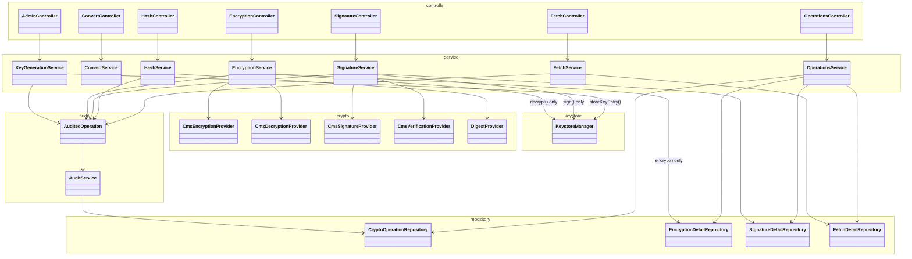

### POST /api/v1/admin/generate-keystore

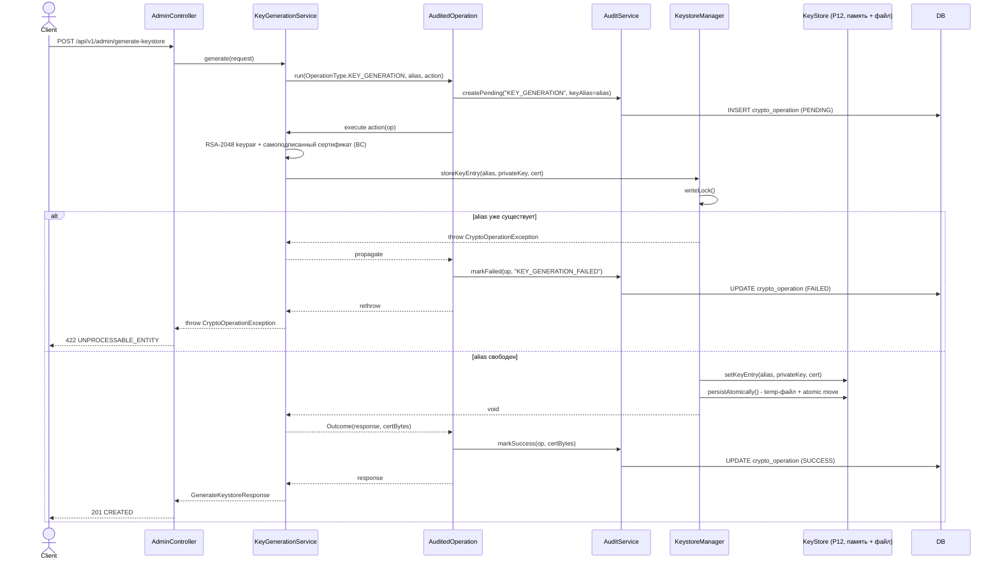

### POST /api/v1/crypto/sign

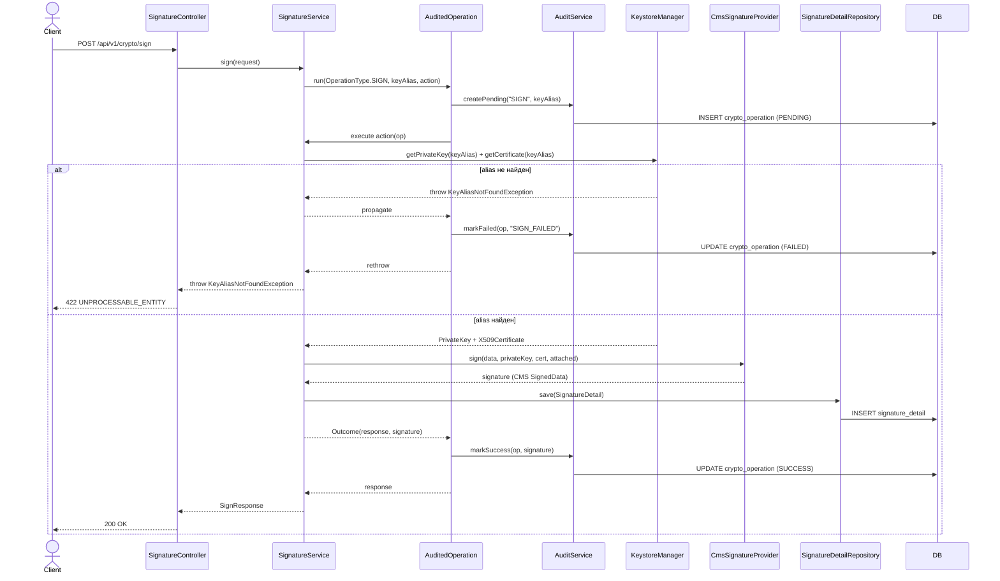

### POST /api/v1/crypto/verify

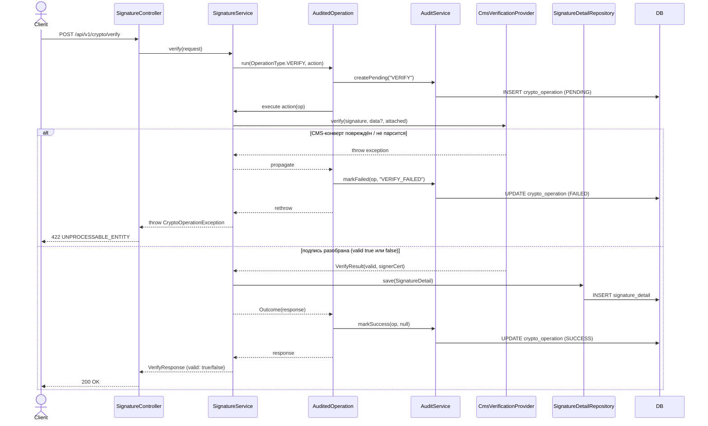

`valid: false` - тоже 200, не ошибка (подпись просто не сошлась). FAILED - только для битого
CMS-конверта. Сертификат подписанта берётся из тела CMS, `KeystoreManager` тут не участвует.

### POST /api/v1/crypto/encrypt

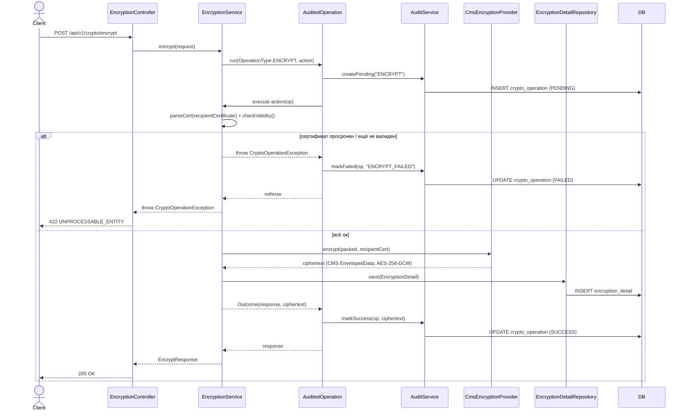

### POST /api/v1/crypto/decrypt

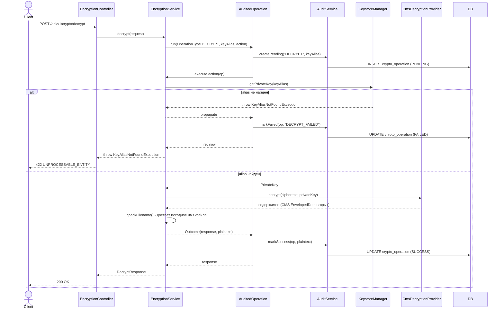

В отличие от `encrypt`, `decrypt` не пишет в `EncryptionDetailRepository` - деталь сохраняется
только один раз, на шаге шифрования.

### POST /api/v1/crypto/hash

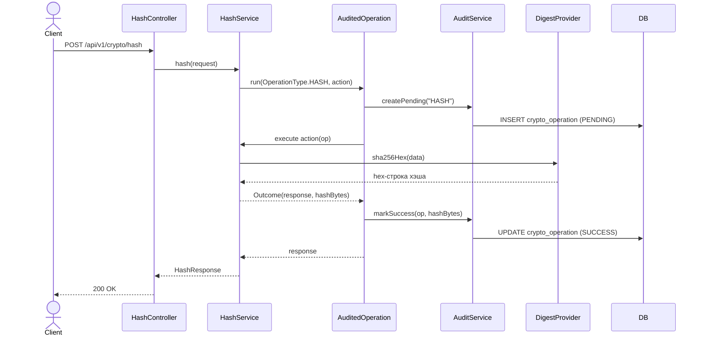

Своей detail-таблицы у `HASH` нет - результат целиком в `crypto_operations.output_hash`.

### POST /api/v1/fetch/document

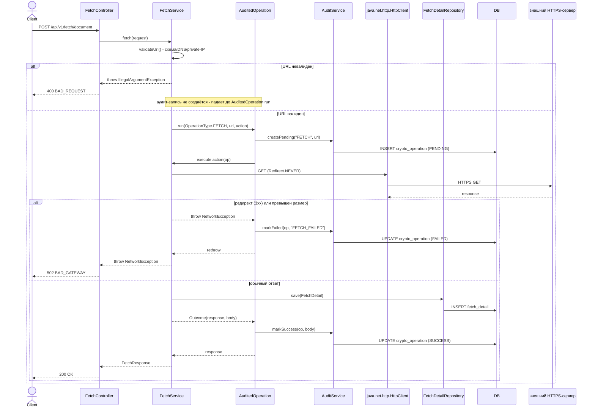

### GET /api/v1/operations

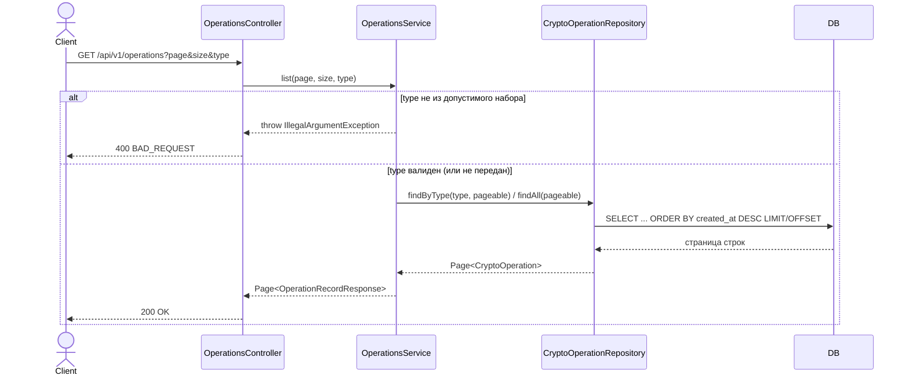

Read-only ручка над аудит-логом - сама новых записей не создаёт, через `AuditedOperation` не идёт.

### GET /api/v1/operations/{id}

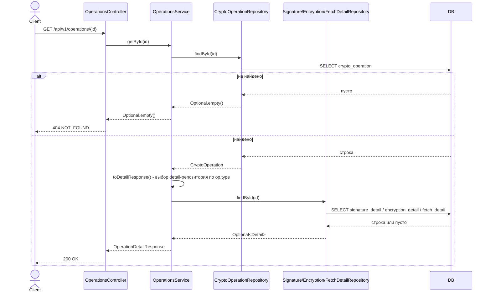

Для `HASH`/`KEY_GENERATION` detail-репозиторий не опрашивается (`default -> {}`) - только общие поля.

### POST /api/v1/convert/encode

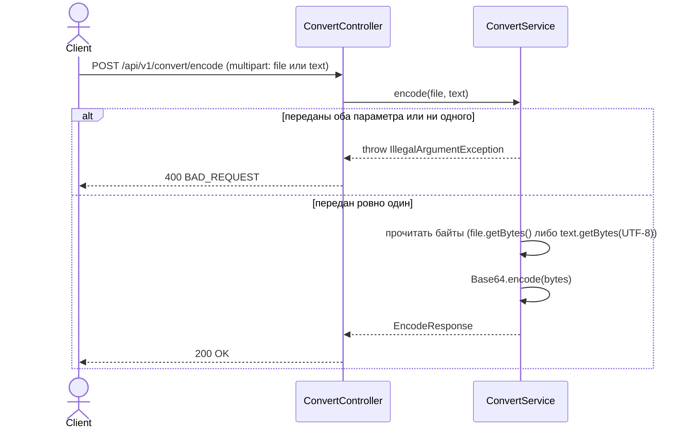

### POST /api/v1/convert/decode

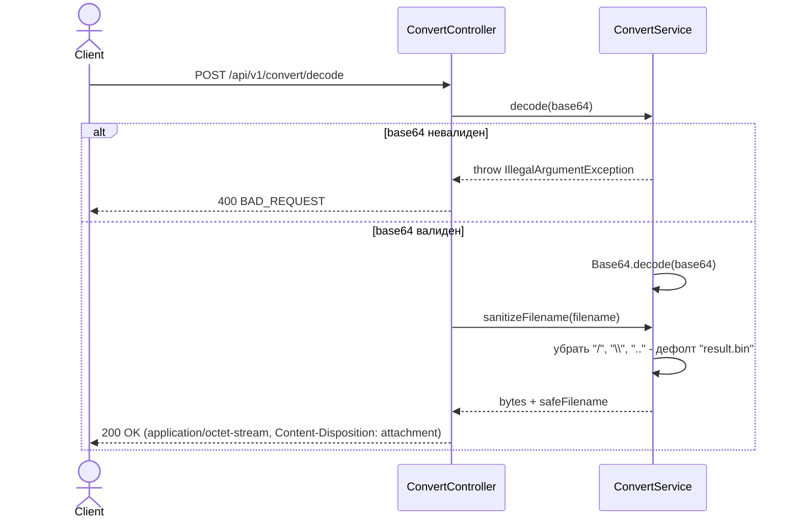

## Переменные окружения

| Переменная          | Что                    | Обязательна                              |
|---------------------|------------------------|------------------------------------------|
| `KEYSTORE_PASSWORD` | пароль от keystore.p12 | да                                       |
| `KEYSTORE_PATH`     | путь к keystore.p12    | нет, по умолчанию `./certs/keystore.p12` |
